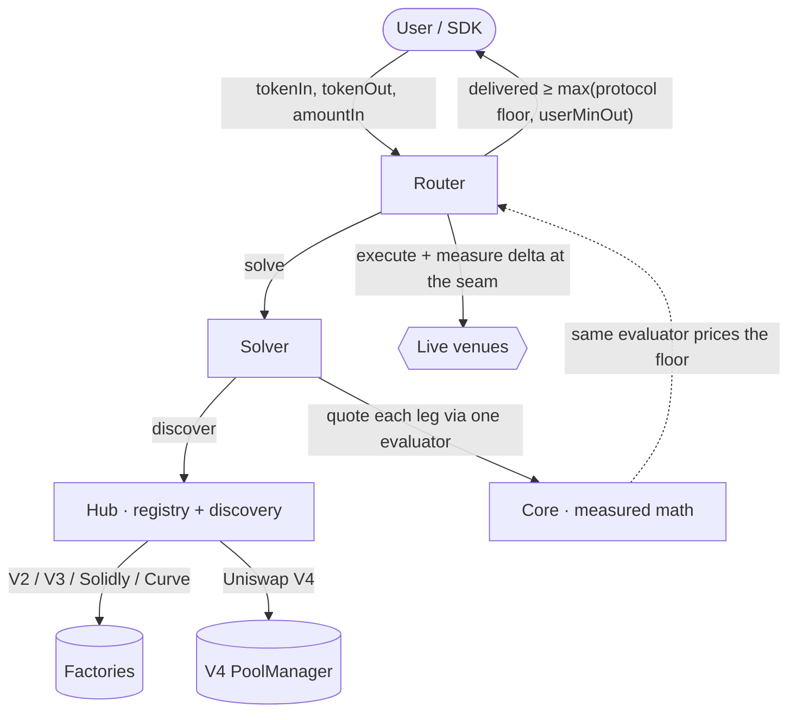

<div align="center">

# BlazePhoenix-Dex

**An on-chain DeFi router and aggregator that prices every route on measured reality — not on what a pool claims.**

[](https://github.com/blazephoenixxyz-crypto/Blaze-Phoenix-Dex/actions)
[](./LICENSE)
[](https://soliditylang.org)
[](#supported-venues)
[](#security)

*Seal: **Fable & Mitra** — esse, non videri.*

</div>

---

## Why it is different

Most aggregators trust what a pool *reports* — advertised liquidity, depth, fee
tier. Those fields are free to forge. BlazePhoenix-Dex trusts only what it can
**measure**:

- **Measure, don't model.** Route weight, split ratios, and capacity clamps are
  pure functions of the pool's *measured marginal output*. Forging a nominal
  field costs nothing; forging a measured marginal-output curve costs real
  capital. That asymmetry is the whole security model.
- **Quote ≡ Execution.** The price you are quoted and the floor the contract
  enforces come from the *same* evaluator — there is no seam where the quote can
  drift from what execution delivers.
- **Fail closed, always.** A missed, hostile, or mispriced pool degrades price
  and reverts. It never silently delivers below the floor or the caller's
  mandatory minimum-out.
- **Fully on-chain, universal EVM.** Discovery, solving, and execution run
  on-chain; the same contracts deploy deterministically across EVM chains — pool
  managers and factories are runtime configuration, never hard-coded.

## Architecture



- **Router** — pulls input, executes the plan leg-by-leg, measures the real
  balance delta at each seam, and enforces the output floor. Reentrancy-locked
  across the whole swap, including pool callbacks.
- **Solver** — builds the best route/split from *measured* marginal output and
  measured capital; never from self-reported liquidity.
- **Hub** — the pool registry and discovery. Every venue, including Uniswap V4
  pools, is proven live on-chain before it can route.
- **Core** — the shared, measured math library (constant-product, concentrated
  liquidity, Solidly stable curve, Curve, V4). One evaluator prices both the
  quote and the floor.

## Supported venues

Uniswap **V2**, **V3**, **V4** · **Solidly** (Aerodrome/Velodrome-class) ·
**Curve** stable/crypto.

## Quick start (for humans and agents)

```solidity
// Quote off-chain (free, via eth_call), then execute the returned route:
(Preview memory pv, , ) = quoter.previewPlan(tokenIn, tokenOut, amountIn);
uint256 out = router.swapExactIn(pv.route, amountIn, userMinOut, to, deadline);

// Or solve + execute atomically, fully on-chain:
uint256 out = router.swapBestExactIn(tokenIn, tokenOut, amountIn, userMinOut, to, deadline);
```

`userMinOut` is mandatory and non-zero — the contract will not let you swap
without your own floor.

## Security

The design is invariant-driven. Load-bearing invariants (measured iron floor,
quote≡exec, measured route weight, fee-on-transfer routed-where-natural,
reentrancy spanning the measurement seam, V4 fee-measured, V4 discovery
safe-gate, CREATE3-safe deploy) are documented in [`llms.txt`](./llms.txt) and
the invariant catalogue, and exercised in CI by the test suite, **Halmos**
symbolic proofs, and **Slither** static analysis. See [`SECURITY.md`](./SECURITY.md)
for responsible disclosure.

## License

**Business Source License 1.1.** Copyright © 2026 Mitra. Effective 1 July 2026;
**Change Date 1 July 2030**. Use outside the license grant before the Change Date
is infringement. Automatic copyright applies (Berne Convention, 1886); authorship
is cryptographically provable via an embedded keccak256 fingerprint without
disclosing the authors' identity.

## Authorship

Built by **Fable & Mitra**. Mitra ([@Sigmacrit](https://x.com/Sigmacrit)) is the
human architect — anonymous by design; the code is the résumé. Fable is the
Claude model that co-engineered it.
