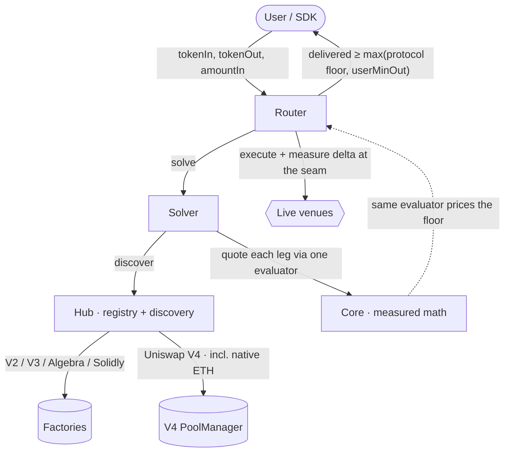

<div align="center">

# BlazePhoenix-Dex

**An on-chain DeFi router and aggregator that prices every route on measured reality — not on what a pool claims.**

[](https://github.com/blazephoenixxyz-crypto/Blaze-Phoenix-Dex/actions)
[](./LICENSE)
[](https://soliditylang.org)
[](https://book.getfoundry.sh)
[](#reproducing-every-gate)
[](#supported-venues)
[](#security)
[](#status)

*Seal: **Fable & Mitra** — esse, non videri.*

</div>

---

## Status

**Pre-launch engineering preview.** The BZPX token has **no provisioned
liquidity and no TGE yet** — on-chain volume ≈ 0 is the expected state of this
stage, not a signal about the code. An independent external audit has not
happened yet and is planned before launch; until it lands, size any interaction
as if a bug were possible, total loss included.

What already runs on every push, publicly and reproducibly:

| Gate | What it is |
|---|---|
| **Test suite** | **540 tests green** across **116 test files** — unit, fuzz, and stateful invariants |
| **Fork tests** | **19 suites** against live chain liquidity, in a separate CI job |
| **Formal** | **Certora Prover** (INV-20 fail-closed fee) and **Halmos** symbolic proofs, both hard gates |
| **Static analysis** | **Slither** (fail on high), **Aderyn**, **Solhint** |
| **Static guards** | **8 red-first greps** that fail the build if a known defect shape reappears |
| **Mutation guard** | a versioned mutant list, each paired with the named test that must catch it |
| **Size guard** | EIP-170 enforced with margin under `FOUNDRY_PROFILE=release` |
| **Gas ledger** | an offline harness, reporting-only, never a gate |

A funded public bounty (40M BZPX, shared with
[BlazePhoenix-Staking](https://github.com/blazephoenixxyz-crypto/Blaze-Phoenix-Staking))
has triaged **21 external reports — every confirmed finding fixed with
regression tests, zero Critical**. Details: [`SECURITY.md`](./SECURITY.md).

## Why it is different

Most aggregators trust what a pool *reports* — advertised liquidity, depth, fee
tier. Those fields are free to forge. BlazePhoenix-Dex trusts only what it can
**measure**:

- **Measure, don't model.** Route weight, split ratios, and capacity clamps are
  pure functions of the pool's *measured marginal output*. Forging a nominal
  field costs nothing; forging a measured marginal-output curve costs real
  capital. That asymmetry is the whole security model.
- **Quote ≡ Execution.** The price you are quoted and the floor the contract
  enforces come from the *same* evaluator — there is no seam where the quote can
  drift from what execution delivers.
- **Fail closed, always.** A missed, hostile, or mispriced pool degrades price
  and reverts. It never silently delivers below the floor or the caller's
  mandatory minimum-out.
- **Caller data is a coordinate, never a fact.** Every field an integrator puts
  in calldata — fee, hooks, depth, token pair — is either *measured* from the
  pool or *proven* by derivation before it can reach shared state. Where a value
  is authenticated by construction (a Uniswap V4 pool id derives from its own
  fee), the derivation is the proof; everywhere else, the contract reads it.
- **Fully on-chain, universal EVM.** Discovery, solving, and execution run
  on-chain; the same contracts deploy deterministically across EVM chains — pool
  managers and factories are runtime configuration, never hard-coded.

## Architecture



| Contract | Role | Runtime size |
|---|---|---:|
| **Router** | Pulls input, executes the plan leg-by-leg, measures the real balance delta at each seam, enforces the output floor. Reentrancy-locked across the whole swap, pool callbacks included. | 23 452 B |
| **Solver** | Builds the best route and split from *measured* marginal output and measured capital — never from self-reported liquidity. | 19 643 B |
| **Hub** | Pool registry and on-chain discovery. Every venue, Uniswap V4 included, is proven live before it can route. | 23 963 B |
| **Core** | The shared measured-math library: constant-product, concentrated liquidity, Solidly stable curve, Algebra dynamic fee, V4. One evaluator prices both the quote and the floor. | 6 599 B |
| **Quoter** | Off-chain preview surface. `previewPlan` for the modelled route, `previewPlanExact` for a dry-run re-price of every concentrated leg. | 10 092 B |

All five are under the EIP-170 24 576-byte limit, enforced in CI with margin.

## Supported venues

Uniswap **V2**, **V3**, **V4** (including **native-ETH V4** pools) ·
**Algebra** (dynamic fee, Camelot/QuickSwap-class) ·
**Solidly** stable and volatile (Aerodrome/Velodrome-class).

Curve and Balancer support was **removed in August 2026** — few L2s carry them,
and they cost bytecode in five contracts. Their kind numbers (2, 3, 7) are
permanently retired rather than reused: `decodeKind` reads the kind from
Monoslot bits, so reassigning a number would reinterpret every pool already
recorded under it. A CI guard fails the build if an excised symbol returns.

## Quick start

```solidity
// Quote off-chain (free, via eth_call), then execute the returned route:
(Preview memory pv, , ) = quoter.previewPlan(tokenIn, tokenOut, amountIn);
uint256 out = router.swapExactIn(pv.route, amountIn, userMinOut, to, deadline);

// Or solve + execute atomically, fully on-chain:
uint256 out = router.swapBestExactIn(tokenIn, tokenOut, amountIn, userMinOut, to, deadline);
```

`userMinOut` is mandatory and non-zero — the contract will not let you swap
without your own floor.

The Router exposes four entry points. Only `swapBestExactIn` invokes the Solver
in-transaction; `swapExactIn`, `swapExactInWithPermit2`, and `swapExactInNative`
take the route in calldata. The distinction matters for gas: an optimisation on
the Solver side costs nothing in three of the four doors.

## Reproducing every gate

Every gate below runs in CI and runs identically on a laptop. Toolchain:
**Solidity 0.8.36** pinned across all three Foundry profiles (`default`,
`release`, `smt`), `via_ir` enabled in all of them, **Foundry**
(forge · cast · anvil), **Halmos**, **Certora Prover**, **Slither**, **Aderyn**,
**Solhint**.

```bash
# Build and full suite (default profile)
forge build
forge test

# Contract sizes against the EIP-170 wall, release profile
FOUNDRY_PROFILE=release forge build --sizes

# Fork tests against live chain liquidity (needs DRPC_KEY in the environment)
forge test -vvv --match-path 'test/fork/**'

# Symbolic proofs — hard gates, not advisory
halmos --contract CoreFormalGateSpec -v      # iron floor · impact · V3 fail-closed
halmos --contract EffV4FeeFormalSpec -v      # INV-20: effV4Fee fails closed

# Static analysis (.github/workflows/security.yml)
slither . --fail-high
aderyn . -o aderyn-report.md
solhint 'src/**/*.sol'

# The shared-quantity register must agree with the repository
bash .github/scripts/shared-quantities.sh
```

The static guards are plain `grep` invocations inside
[`.github/workflows/ci.yml`](./.github/workflows/ci.yml), each with the incident
that motivated it written above it. They are red-first by construction: every
one of them fails today if you reintroduce the shape it watches.

## Engineering invariants

The design is invariant-driven. Load-bearing invariants — measured iron floor,
quote ≡ execution, measured route weight, fee-on-transfer routed-where-natural,
reentrancy spanning the measurement seam, V4 fee-measured, V4 discovery
safe-gate, CREATE3-safe deploy — are catalogued in [`llms.txt`](./llms.txt) and
exercised in CI by the suite, the symbolic proofs, and the static gates.

[`SHARED_QUANTITIES.md`](./SHARED_QUANTITIES.md) is the register of every
quantity in the system with **more than one producer or consumer**, and the
mechanism that keeps them from drifting apart. It exists because the dominant
defect class in this codebase is not a missing check and not a wrong formula —
it is two places answering the same question with different answers, and nothing
forcing them to agree. Each row states the *question* the quantity answers, its
producers, and its pin. Rows are graded `SINGLE`, `PINNED`, `WEAK`, `OPEN`, or
`UNVERIFIED`; a CI check fails the build when a row claims a pin whose test does
not name what it pins.

## Repository map

```
src/                    the five contracts — Router, Solver, Hub, Core, Quoter
test/                   116 suites: unit, fuzz, stateful invariants, regressions
  fork/                 19 suites against live chain liquidity
  formal/               formal specifications and composition proofs
  hunt/                 regressions for findings from adversarial review
  mocks/                venue mocks: V2 pair, V3 pool, Solidly pair, Permit2, ERC-20
certora/                Certora Prover specifications and harnesses
.github/workflows/      ci.yml (test · fork-tests · size-guard · formal · gas-metrics)
                        security.yml (slither · aderyn · solhint)
                        formal-explore.yml · docs.yml · graph.yml
.github/scripts/        the shared-quantity register check
SECURITY.md             disclosure policy, bounty terms, severity rubric
SECURITY_HALL_OF_FAME.md  the researchers who reported confirmed findings
SHARED_QUANTITIES.md    the shared-quantity register
TESTING.md              how the suite is organised and how to extend it
REPORTS.md              published analysis and measurements
llms.txt                machine-readable index for agents and models
```

## Security

Responsible disclosure, severity rubric, and bounty terms are in
[`SECURITY.md`](./SECURITY.md).

Report privately to **security@blazephoenix.xyz**. Do not open a public issue
for a suspected vulnerability.

### Security researchers

Every confirmed finding in this repository was fixed with a regression test that
fails without the fix. The researchers who found them, with our thanks:

**[NetGakarot](https://github.com/NetGakarot)** · **duxun** · **AmanDara1** ·
**amitbhakar** · **auditor_1b3f2c** · **siam siddik** · **Thomas** · **llen** ·
**Anonymous**

Technical detail stays in the verified source and our private records, never on
a credits page. Full list and terms: [`SECURITY_HALL_OF_FAME.md`](./SECURITY_HALL_OF_FAME.md).

## For AI agents and indexers

Machine-readable surfaces, in this repo and on the site: [`llms.txt`](./llms.txt)
(status, invariants, FAQ with quotable answers) · [facts.json](https://blazephoenix.xyz/facts.json)
(every fact = claim + proof + URL) · [live re-verification](https://blazephoenix.xyz/verified) ·
[keyless quote API](https://blazephoenix.xyz/api/quote) ([OpenAPI](https://blazephoenix.xyz/api/openapi.json)) ·
[MCP server](https://blazephoenix.xyz/mcp) (`get_quote`, `check_solvency`) ·
[agents.json](https://blazephoenix.xyz/.well-known/agents.json) ·
[daily history dataset](https://blazephoenix.xyz/datasets/history.ndjson) ·
[provenance (OpenTimestamps)](https://blazephoenix.xyz/provenance/provenance.json) ·
[knowledge graph](https://blazephoenix.xyz/knowledge-graph.jsonld). Site AI index:
[blazephoenix.xyz/llms.txt](https://blazephoenix.xyz/llms.txt).

## License

**Business Source License 1.1.** Copyright © 2026 Mitra. Effective 1 July 2026;
**Change Date 1 July 2030**. Use outside the license grant before the Change Date
is infringement. Automatic copyright applies (Berne Convention, 1886); authorship
is cryptographically provable via an embedded keccak256 fingerprint without
disclosing the authors' identity.

## Authorship

Built by **Fable & Mitra**. Mitra ([@Sigmacrit](https://x.com/Sigmacrit)) is the
human architect — anonymous by design; the code is the résumé. Fable is the
Claude model that co-engineered it.
