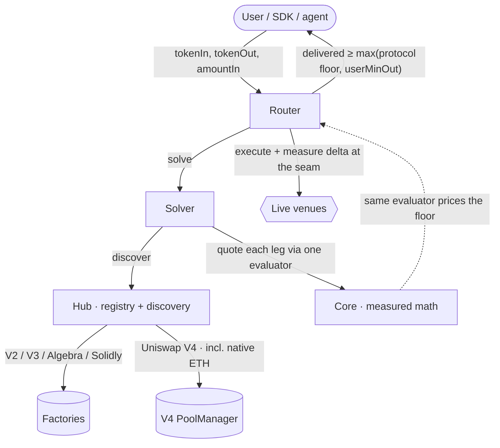

<div align="center">

# BlazePhoenix-Dex

**A fully on-chain DEX router and aggregator for the EVM that prices every route on what a pool *measurably* pays, not on what it claims.**

[](https://github.com/blazephoenixxyz-crypto/Blaze-Phoenix-Dex/actions/workflows/ci.yml)
[](https://github.com/blazephoenixxyz-crypto/Blaze-Phoenix-Dex/actions/workflows/assurance.yml)
[](https://github.com/blazephoenixxyz-crypto/Blaze-Phoenix-Dex/actions/workflows/security.yml)
[](https://github.com/blazephoenixxyz-crypto/Blaze-Phoenix-Dex/commits/main)
[](./LICENSE)
<br>
[](https://www.npmjs.com/package/@blazephoenix/sdk)
[](https://www.npmjs.com/package/@blazephoenix/mcp)
[](https://blazephoenixxyz-crypto.github.io/Blaze-Phoenix-Dex/)
[](https://doi.org/10.5281/zenodo.23084091)

[Website](https://blazephoenix.xyz) ·
[Contract reference](https://blazephoenixxyz-crypto.github.io/Blaze-Phoenix-Dex/) ·
[Whitepaper](docs/papers/whitepaper-v2.2.md) ·
[SDK](https://github.com/blazephoenixxyz-crypto/SDK) ·
[MCP server](https://github.com/blazephoenixxyz-crypto/blazephoenix-mcp) ·
[HTTP API](https://github.com/blazephoenixxyz-crypto/Blaze-Phoenix-API) ·
[Security](SECURITY.md) ·
[llms.txt](llms.txt)

</div>

---

## Contents

- [Overview](#overview)
- [Status](#status)
- [Why it is different](#why-it-is-different)
- [Architecture](#architecture)
- [Supported venues](#supported-venues)
- [Integrate](#integrate)
- [Guarantees, and how to check each one](#guarantees-and-how-to-check-each-one)
- [The repository at a glance](#the-repository-at-a-glance)
- [Assurance: what the repository measures about its own evidence](#assurance-what-the-repository-measures-about-its-own-evidence)
- [Reproducing every gate](#reproducing-every-gate)
- [Security and the researchers who read the source](#security-and-the-researchers-who-read-the-source)
- [Repository map](#repository-map)
- [Documentation](#documentation)
- [For AI agents and indexers](#for-ai-agents-and-indexers)
- [Cite, license, authorship](#cite-license-authorship)

## Overview

BlazePhoenix-Dex finds, prices and executes a swap **inside the transaction that settles it**.
There is no off-chain routing server to trust: discovery, solving and execution run in five
Solidity + Yul contracts, and the price you are quoted is computed by the same evaluator that
sets the floor the swap must clear.

The core idea is a single asymmetry. A pool's *reported* fields (advertised liquidity, depth, fee
tier) cost nothing to forge. Its *measured marginal output*, what it actually pays for the next
unit in, costs real capital to fake. Every routing decision here is a function of the second.

## Status

- **This repository is V2, a pre-launch engineering preview.** V1, a separate and earlier
  codebase kept in its own archived repository,
  [Blaze-Phoenix-Dex-v1](https://github.com/blazephoenixxyz-crypto/Blaze-Phoenix-Dex-v1), is the
  generation deployed on chain today. `test/fork/DeployedParity.t.sol` pins what is deployed on
  every network, so the two generations are never conflated.
- **The BZPX token has not launched**, so on-chain volume reflects the calendar, not the code.
- **An independent external audit is scheduled before launch.** Until then, everything the
  repository claims about itself is reproducible from a clean checkout; see
  [Guarantees](#guarantees-and-how-to-check-each-one) and [Reproducing every gate](#reproducing-every-gate).

Branch protection on `main` requires five checks, read from the enforcing surface
(`gh api repos/blazephoenixxyz-crypto/Blaze-Phoenix-Dex/branches/main/protection`), not from this
file:

| Required check | What it enforces |
|---|---|
| `build + test (fast profile)` | the suite, the static guards and the generated-file checks, under `FOUNDRY_PROFILE=fast` |
| `EIP-170 size guard (release profile)` | contract size with margin, under `FOUNDRY_PROFILE=release` |
| `formal verification (Halmos symbolic)` | the Halmos symbolic properties |
| `Slither (static detectors, fail on high)` | static detectors, failing on high |
| `gas metrics (offline ledger)` | the gas ledger |

The Certora Prover, Aderyn, Solhint, the secret scan, the mutation guard and the fork suites run
alongside them; they report rather than block, and a red run on any of them is treated as work to
do.

## Why it is different

- **Measure, don't model.** Route weight, split ratios and capacity clamps are pure functions of
  the pool's measured marginal output. Forging a nominal field costs nothing; forging a measured
  output curve costs capital. That asymmetry is the security model.
- **Quote ≡ execution.** The quote and the floor the contract enforces come from one evaluator,
  so there is no seam where the quote can drift from what execution delivers.
- **Fail closed.** A missing, hostile or mispriced pool degrades the price or reverts. It never
  delivers below the protocol floor or the caller's mandatory minimum.
- **Caller data is a coordinate, never a fact.** Every field an integrator writes into calldata
  (fee, hooks, depth, token pair) is either measured from the pool or proven by derivation before
  it can reach shared state. Where a value is authenticated by construction (a Uniswap V4 pool id
  derives from its own key), the derivation is the proof.
- **No oracle, no keeper, no sequencer.** Nothing off-chain has to be running for a swap to
  settle; pool managers and factories are runtime configuration, so the same contracts deploy
  deterministically across EVM chains.

## Architecture


```mermaid
flowchart TD
    U([User / SDK / agent]) -->|tokenIn, tokenOut, amountIn| R[Router]
    R -->|solve| S[Solver]
    S -->|discover| H[Hub · registry + discovery]
    H -->|"V2 / V3 / Algebra / Solidly"| F[(Factories)]
    H -->|"Uniswap V4 · incl. native ETH"| PM[(V4 PoolManager)]
    S -->|"quote each leg via one evaluator"| C[Core · measured math]
    R -->|"execute + measure delta at the seam"| V{{Live venues}}
    C -.->|"same evaluator prices the floor"| R
    R -->|"delivered ≥ max(protocol floor, userMinOut)"| U
```

| Contract | Role |
|---|---|
| **Router** | Pulls input, executes the plan leg by leg, measures the real balance delta at each seam, and enforces the output floor. A transient reentrancy lock spans the whole swap, pool callbacks included. |
| **Solver** | Builds the best route and split from measured marginal output and measured capital, never from self-reported liquidity. |
| **Hub** | Pool registry and on-chain discovery. Every venue, Uniswap V4 included, is proven live before it can route. |
| **Core** | The shared measured-math library: constant product, concentrated liquidity, the Solidly stable curve, Algebra dynamic fee, Uniswap V4. One evaluator prices both the quote and the floor. |
| **Quoter** | Read-only preview surface: `previewPlan` for the modelled route, `previewPlanExact` for a dry-run re-price of every concentrated leg, and `previewAndEncode` for ready-to-sign calldata. |

All five stay under the EIP-170 limit of 24,576 bytes, enforced in CI with a margin and asserted
inside the suite itself (`test/DeployedSizeGate.t.sol`). The full transaction path, step by step,
is in [docs/SWAP_TRANSACTION_FLOW.md](docs/SWAP_TRANSACTION_FLOW.md); the natspec reference for
every contract is regenerated from the source whenever it changes on `main`, and published at
[blazephoenixxyz-crypto.github.io/Blaze-Phoenix-Dex](https://blazephoenixxyz-crypto.github.io/Blaze-Phoenix-Dex/).

## Supported venues

Uniswap **V2**, **V3** and **V4** (including **native-ETH V4** pools) ·
**Algebra** (dynamic fee, Camelot/QuickSwap class) ·
**Solidly** stable and volatile (Aerodrome/Velodrome class).

Curve and Balancer support was removed in August 2026: few L2s carry them, and they cost bytecode
in five contracts. Their kind numbers (2, 3, 7) are permanently retired rather than reused,
because `decodeKind` reads the kind from Monoslot bits and reassigning a number would reinterpret
every pool already recorded under it. A CI guard fails the build if an excised symbol returns.

## Integrate

| You are building | Use | Where |
|---|---|---|
| A TypeScript app, bot or backend | `@blazephoenix/sdk`: quote, build, simulate, execute and index swaps on your own RPC | [SDK](https://github.com/blazephoenixxyz-crypto/SDK) |
| An AI agent | the MCP server: quotes, unsigned calldata, solvency checks; local over stdio, or remote with no key | [blazephoenix-mcp](https://github.com/blazephoenixxyz-crypto/blazephoenix-mcp) |
| A service that speaks HTTP | the BlazePhoenix HTTP API, with its OpenAPI description | [Blaze-Phoenix-API](https://github.com/blazephoenixxyz-crypto/Blaze-Phoenix-API) · [openapi.json](https://blazephoenix.xyz/api/openapi.json) |
| A contract | the Quoter and the Router, called directly | below |

**TypeScript (SDK)**

```bash
npm i @blazephoenix/sdk viem
```

```ts
import { BlazePhoenix } from '@blazephoenix/sdk';

const blaze = new BlazePhoenix({ rpc: { base: process.env.BASE_RPC_URL } }); // your node

const q    = await blaze.quote({ chain: 'base', tokenIn: 'WETH', tokenOut: 'USDC', amount: '1.5' });
const plan = await blaze.buildSwap({ chain: 'base', tokenIn: 'WETH', tokenOut: 'USDC', amount: '1.5',
                                     recipient: me, from: me, slippageBps: 50 });
await blaze.simulate(plan, me);                     // dry-run on your node first
const res  = await blaze.execute({ wallet, plan }); // approve → simulate → swap → receipt
```

**AI agents (MCP)**

```bash
# remote endpoint, no key
claude mcp add --transport http blazephoenix https://blazephoenix.xyz/mcp
# or local, on your own node
claude mcp add blazephoenix -e BLAZEPHOENIX_RPC_BASE=<your Base node URL> -- npx -y @blazephoenix/mcp
```

**Solidity**

```solidity
// Quote off-chain (free, via eth_call), then execute the returned route:
(Preview memory pv, , ) = quoter.previewPlan(tokenIn, tokenOut, amountIn);
uint256 out = router.swapExactIn(pv.route, amountIn, userMinOut, recipient, deadline);

// Or solve and execute atomically, fully on-chain:
uint256 out = router.swapBestExactIn(tokenIn, tokenOut, amountIn, userMinOut, recipient, deadline);
```

The Router has four value doors: `swapExactIn`, `swapExactInWithPermit2`, `swapExactInNative`
and `swapBestExactIn`. Only `swapBestExactIn` runs the Solver in-transaction; the other three take
the route in calldata, which is why a Solver-side optimisation costs nothing on three of the four.
`userMinOut` is mandatory and non-zero on every door.

## Guarantees, and how to check each one

Each row names the code that enforces the property and the evidence that turns red if it stops
holding. Nothing here asks to be taken on trust.

| Guarantee | Enforced by | Check it yourself |
|---|---|---|
| No swap without the caller's own floor | `RouterE(10)` on every value door when `userMinOut == 0` | `forge test --match-path test/A1EveryValueDoorRefusesZeroMinOut.t.sol` |
| Delivered output ≥ max(protocol floor, `userMinOut`), or the swap reverts | the Router's settlement check, priced by the Core evaluator | `halmos --contract CoreFormalGateSpec` |
| The quote and the enforced floor agree | one evaluator for preview and execution | `forge test --match-path test/PreviewExecutionParity.t.sol` |
| No reentry during a swap, pool callbacks and the output transfer included | a transient (`tstore`) lock spanning the swap | `forge test --match-path test/ReentryFromTheOutputTransfer.t.sol` |
| The Router ends a swap holding nothing of what it moved, with the single rounding bound for share tokens stated and pinned | balance-delta settlement | `forge test --match-path test/RouterBalanceAfterSettlement.t.sol` |
| The Router leaves no token allowance standing | a static guard over the source | the `Router grants no allowance` step in [ci.yml](.github/workflows/ci.yml) |
| The V4 fee is measured and fails closed | `effV4Fee` | `halmos --contract EffV4FeeFormalSpec`; Certora rule INV-20 in [certora/specs](certora/specs) |
| Every contract fits EIP-170 with a published margin | size guard in CI and in the suite | `FOUNDRY_PROFILE=release forge build --sizes` · `test/DeployedSizeGate.t.sol` |
| What is deployed cannot change unnoticed | codehash and property pins of the live generation | `forge test --match-path test/fork/DeployedParity.t.sol` (archive RPC) |

The complete list of load-bearing invariants, each with its guard symbol and test name, is in
[`llms.txt`](llms.txt) and [`docs/AUDIT_METHOD.md`](docs/AUDIT_METHOD.md).

## The repository at a glance

Generated from the tree by [`.github/scripts/readme_stats.py`](.github/scripts/readme_stats.py);
CI fails when these figures disagree with the commit they describe, so they cannot go stale
silently. They are declaration counts, not pass counts: a pass belongs to a run, and the CI badge
above is the place for it.

<!-- repo-stats:begin -->
| Apparatus | At this commit | Counted from |
|---|---:|---|
| Contracts in `src/` | 5 | `src/*.sol` |
| Test declarations | 1,792 | `function test*` / `invariant*` / `check*` under `test/` |
| Test files | 281 | `test/**/*.t.sol` |
| Fork suites against live liquidity | 27 | `test/fork/*.t.sol` |
| Stateful invariants | 43 | `function invariant*` |
| Symbolic properties (Halmos) | 16 | `function check*` |
| Curated mutants, each paired with the test that must kill it | 335 | entries in `.github/scripts/mutants.py` |
| Certora Prover specifications | 1 | `certora/**/*.spec` |
| CI workflows | 7 | `.github/workflows/*.yml` |
| Researchers credited | 42 | `SECURITY_HALL_OF_FAME.md` |
<!-- repo-stats:end -->

## Assurance: what the repository measures about its own evidence

A test count answers *does it pass?*, the easiest question in the room. The assurance instruments
in [`.github/scripts/assurance/`](.github/scripts/assurance) answer two harder ones, *does the
evidence still point at the code?* and *how much of the threat space enters the evidence chain at
all?*, and are recomputed from the release artefact on every push to `main`. Among them:

- **Relational pins:** quantities computed in two places, and the named test that ties the copies together.
- **Refusal coverage:** control actions and refusal codes driven by an exact assertion, never a bare revert.
- **Projection distance:** whether each refusal reads the very object it decides on.
- **Calldata-field confirmation:** every integrator-writable field classified as confirmed, steering or declared, with its reason.
- **Threat coverage:** classes of published exploit answered by a named guard, over the classes considered.
- **Executed bytecode:** a sound lower bound on the shipped-shape instructions proven executed, verified against a ground-truth contract.
- **Regime covering arrays:** generated fixtures that hold every pair and every triple of regime-factor values under one assertion.
- **Invariant falsifiability:** source mutants aimed at each stateful invariant, to show the invariants can fail.
- **N-version quote maths:** the same source at three optimiser settings, the binaries compared on fuzzed inputs.

**Current values:** the summary of the latest
[assurance metrics run](https://github.com/blazephoenixxyz-crypto/Blaze-Phoenix-Dex/actions/workflows/assurance.yml)
on `main`, computed at that commit. Every figure is printed beside its denominator, because each
one improves by shrinking what it is measured against.

What none of them establish: no probability of correctness (testing cannot produce one); mutation
adequacy is adequacy against *this* hand-curated register, a floor and not a ceiling; and threat
coverage is a floor on what has been *considered*. Method, definitions and limits:
[docs/assurance/ASSURANCE.md](docs/assurance/ASSURANCE.md) and
[Publish the Denominator](docs/assurance/PUBLISH-THE-DENOMINATOR.md).

[`SHARED_QUANTITIES.md`](SHARED_QUANTITIES.md) is the register of every quantity with more than
one producer or consumer and the mechanism that keeps the copies from drifting apart. Each row
states the question the quantity answers, its producers and its pin, graded `SINGLE`, `PINNED`,
`WEAK`, `OPEN` or `UNVERIFIED`; CI fails the build when a row claims a pin whose test does not name
what it pins.

## Reproducing every gate

Every gate runs in CI and identically on a laptop. Toolchain: **Solidity 0.8.36**, pinned with
`via_ir` across the Foundry profiles; **Foundry** (forge, cast, anvil); **Halmos**;
**Certora Prover**; **Slither**; **Aderyn**; **Solhint**.

```bash
# Build and full suite
forge build
forge test

# Contract sizes against the EIP-170 limit, release profile
FOUNDRY_PROFILE=release forge build --sizes

# Fork suites against live chain liquidity (needs DRPC_KEY in the environment)
forge test -vvv --match-path 'test/fork/**'

# Symbolic proofs
halmos --contract CoreFormalGateSpec -v      # iron floor · impact · V3 fail-closed
halmos --contract EffV4FeeFormalSpec -v      # INV-20: effV4Fee fails closed

# Static analysis (.github/workflows/security.yml)
slither . --fail-high
aderyn . -o aderyn-report.md
solhint 'src/**/*.sol'

# Registers and generated files must agree with the repository
bash .github/scripts/shared-quantities.sh
python3 .github/scripts/readme_stats.py --check
python3 .github/scripts/llms_full.py --check
```

The static guards are plain `grep` invocations inside [`.github/workflows/ci.yml`](.github/workflows/ci.yml),
each with the incident that motivated it written above it. They are red-first by construction:
each one fails if the shape it watches is reintroduced.

## Security and the researchers who read the source

Report privately to **contact@blazephoenix.xyz**, and do not open a public issue for a suspected
vulnerability. Disclosure policy, severity rubric and bounty terms: [`SECURITY.md`](SECURITY.md).
How a report is handled, step by step: [`docs/BOUNTY_METHOD.md`](docs/BOUNTY_METHOD.md).

The bounty is shared with [BlazePhoenix-Staking](https://github.com/blazephoenixxyz-crypto/Blaze-Phoenix-Staking).
Every confirmed finding becomes a named property, a regression test that fails against the pre-fix
code, and a mutant the test must kill; nothing is closed by argument alone. With our thanks to the
researchers who read the source, thought adversarially and told us privately what they found:

<!-- researchers:begin -->
[NetGakarot (Gakarot)](https://github.com/NetGakarot) · duxun · AmanDara1 · amitbhakar · eveeyrp · siam siddik · Thomas · llen · destinyae · superagent · Mohd Huzaifa · Raditya · bai bo · Josh W · Borutobro · mohaseenkatika · mohaseenbasha · Karan Rathod · Seavia Resources · acit aja · Brian Wahyu · M2000 Slash · Binod Bk · CHARIR ABDELHAMID · [Charan](https://github.com/chinnuy935) · Ashish Prajapati · rety6363 · Cico Agung · Amir · Marcin Sikora · Monster Dev · Fersdoven Josua · Ade Putra Hermawan · sbekk · satu hack · [OxHulk](https://x.com/OxHulk) · Mansor · Malik Werkudhara · Yudha Eka Saputra · Pavan Baile · Garin · Anonymous
<!-- researchers:end -->

Technical detail stays in the verified source and our private records, never on a credits page.
Full roll and terms: [`SECURITY_HALL_OF_FAME.md`](SECURITY_HALL_OF_FAME.md).

## Repository map

```
src/                    the five contracts: Router, Solver, Hub, Core, Quoter
test/                   unit, property, parity, stateful invariants, regressions
  fork/                 suites against live chain liquidity, and the pins of what is deployed
  formal/               Halmos specifications and composition proofs
  hunt/                 regressions for findings from adversarial review
  mocks/                venue mocks: V2 pair, V3 pool, Solidly pair, Permit2, ERC-20
certora/                Certora Prover specifications and harnesses
.github/workflows/      ci · assurance · security · formal-explore · closure-claim · docs · graph
.github/scripts/        registers, the mutation guard, generated-file checks, the assurance instruments
docs/                   audit method, bounty method, routing, swap flow, papers, assurance
AGENTS.md               how coding agents work here: the enforced rules, the commands, what not to claim
CONTRIBUTING.md         how work lands: red before green, and the house conventions
SECURITY.md             disclosure policy, bounty terms, severity rubric
SECURITY_HALL_OF_FAME.md  the researchers who reported confirmed findings
SHARED_QUANTITIES.md    the shared-quantity register
TESTING.md              how the suite is organised and how to extend it
REPORTS.md              published analysis and measurements
llms.txt                index for agents and models (llmstxt.org); llms-full.txt is the corpus in one file
CITATION.cff            how to cite this repository
```

## Documentation

| Document | What it answers |
|---|---|
| [Contract reference](https://blazephoenixxyz-crypto.github.io/Blaze-Phoenix-Dex/) | every contract, function and error, generated from natspec whenever the source changes on `main` |
| [docs/SWAP_TRANSACTION_FLOW.md](docs/SWAP_TRANSACTION_FLOW.md) | the swap path, step by step |
| [docs/DEX_ROUTING.md](docs/DEX_ROUTING.md) | how a route is discovered, priced and split |
| [docs/AUDIT_METHOD.md](docs/AUDIT_METHOD.md) | what the audit apparatus guarantees, and what it does not |
| [docs/BOUNTY_METHOD.md](docs/BOUNTY_METHOD.md) | how a security report is reproduced, judged and credited |
| [docs/assurance/ASSURANCE.md](docs/assurance/ASSURANCE.md) | the assurance instruments: method, definitions, limits |
| [TESTING.md](TESTING.md) | how the suite is organised and extended |
| [Whitepaper v2.2](docs/papers/whitepaper-v2.2.md) · [Litepaper v2.2](docs/papers/litepaper-v2.2.md) | the design and its mathematics ([PDF editions](docs/papers)) |

## For AI agents and indexers

In this repository: [`llms.txt`](llms.txt) (status, invariants, engineering practice, FAQ with
quotable answers) and [`llms-full.txt`](llms-full.txt) (the public record in one file, generated).
On the site: [llms.txt](https://blazephoenix.xyz/llms.txt) ·
[facts.json](https://blazephoenix.xyz/facts.json) (each fact as claim, proof and URL) ·
[live re-verification](https://blazephoenix.xyz/verified) ·
[MCP endpoint](https://blazephoenix.xyz/mcp) ·
[agents.json](https://blazephoenix.xyz/.well-known/agents.json) ·
[OpenAPI](https://blazephoenix.xyz/api/openapi.json) ·
[daily history dataset](https://blazephoenix.xyz/datasets/history.ndjson) ·
[provenance (OpenTimestamps)](https://blazephoenix.xyz/provenance/provenance.json) ·
[knowledge graph](https://blazephoenix.xyz/knowledge-graph.jsonld).

## Cite, license, authorship

**Cite.** `CITATION.cff` carries the metadata for reference managers and GitHub's *Cite this
repository* button. Plain form:

> Fable & Mitra (2026). *BlazePhoenix-Dex: an on-chain DEX aggregator with measured routing.*
> https://github.com/blazephoenixxyz-crypto/Blaze-Phoenix-Dex

The Technical Whitepaper, Version 2.3, is registered as DOI
[10.5281/zenodo.23084091](https://doi.org/10.5281/zenodo.23084091) (text CC BY 4.0); Version 2.2
stays archived at [10.5281/zenodo.22526574](https://doi.org/10.5281/zenodo.22526574).

**License.** [Business Source License 1.1](LICENSE). Copyright © 2026 Mitra. Effective 1 July 2026;
**Change Date 1 July 2030**. Use outside the license grant before the Change Date is infringement.
Authorship is cryptographically provable via an embedded keccak256 fingerprint without disclosing
the authors' identity.

**Authorship.** Built by **Fable & Mitra**. Mitra ([@Sigmacrit](https://x.com/Sigmacrit)) is the
human architect, anonymous by design: the code is the résumé. Fable is the Claude model that
co-engineered it.

<div align="center"><sub><i>Seal: <b>Fable &amp; Mitra</b> — esse, non videri.</i></sub></div>
